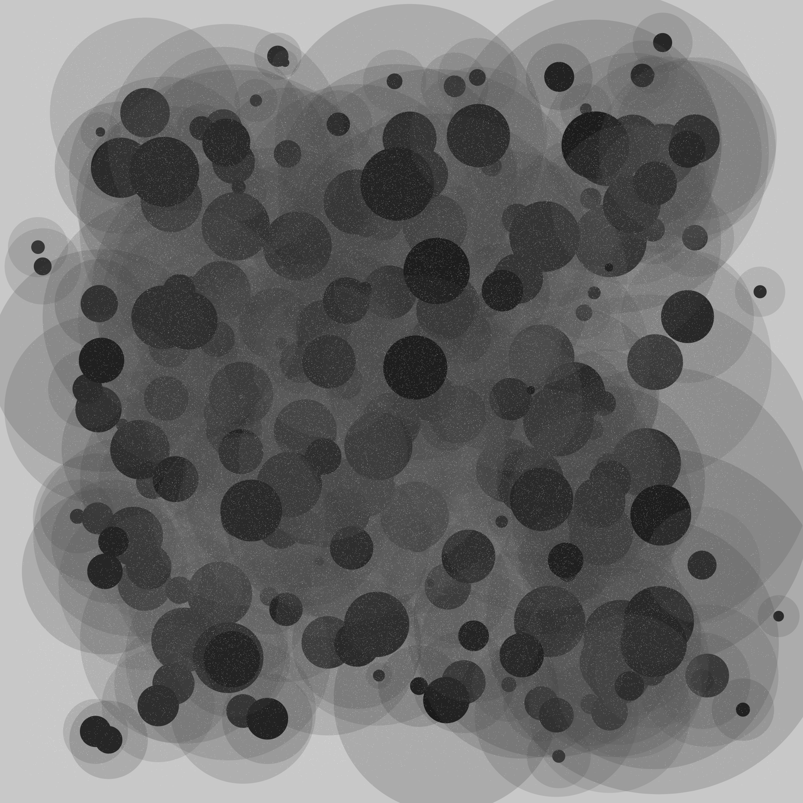

This is **Reshinth Adithyan**(Not the below art), you can call me **Reshinth**. I am a Researcher/Research Engineer working in the intersection of Machine Learning on Code by 🔆 and 
working at <a href="https://sites.google.com/view/mldmm-lab/home">MLDMM Lab</a> by the 🌌. 

  

 
## What are my interests ? 
- Code Representation Learning.   
- Geometric Representation Learning.   
- Naturalness in Code. 
- Self-Supervised Learning.
- _Creative Coding_
